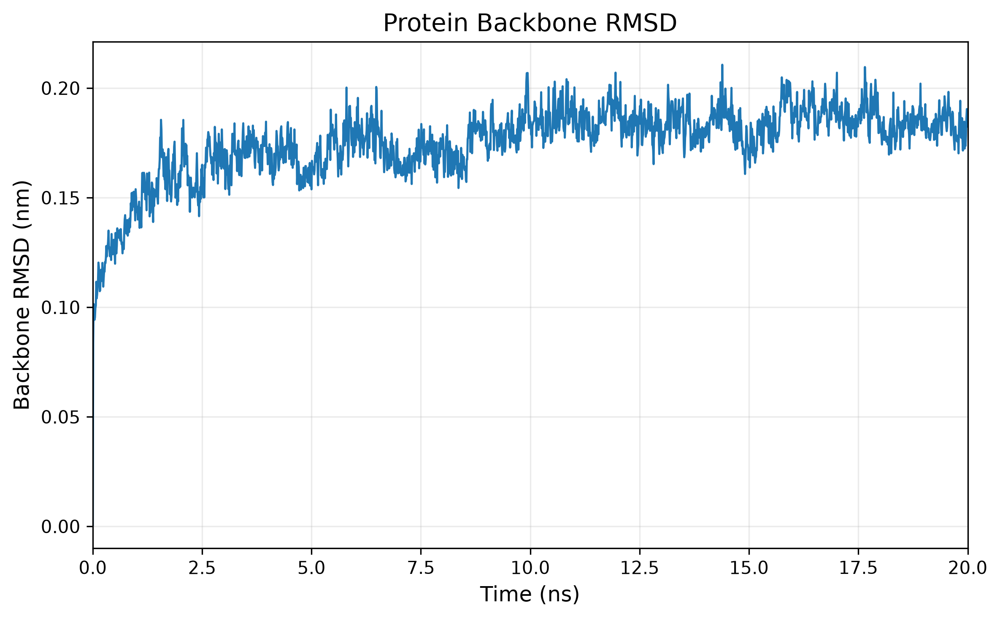
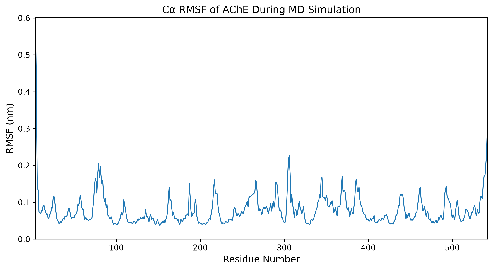
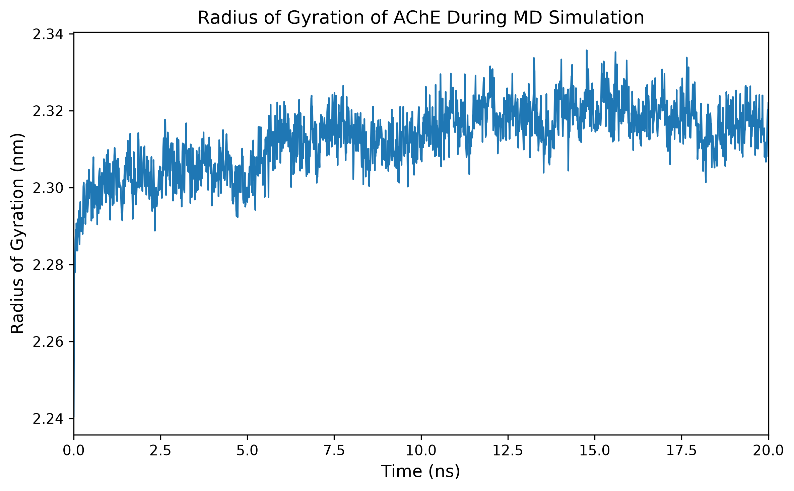
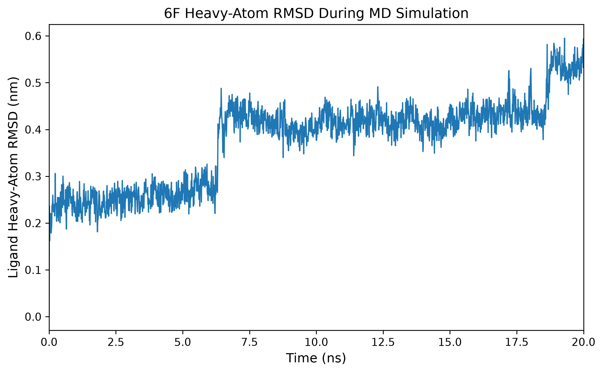
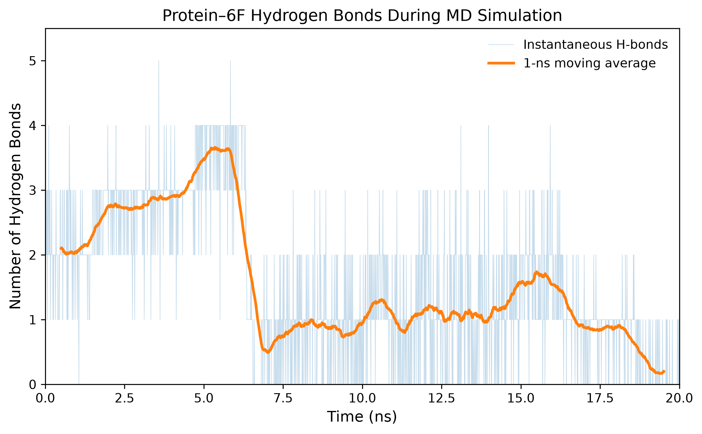
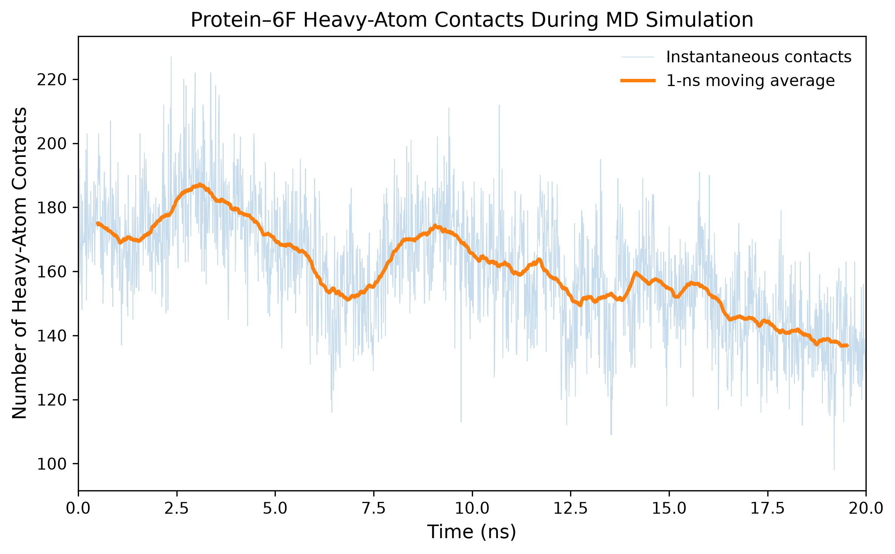
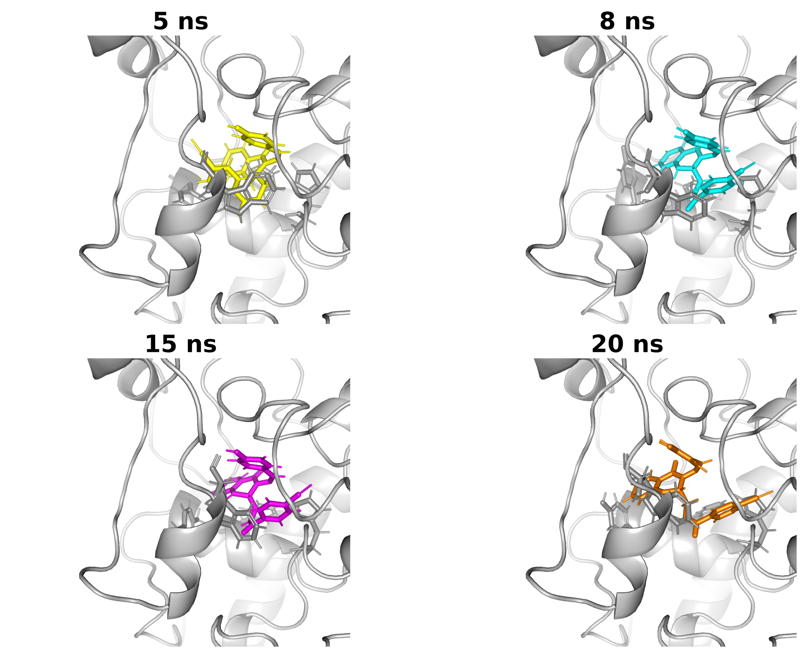

# Computational Study of an Acetylcholinesterase Inhibitor

This repository documents a structure-based computational investigation of **compound 6F** in complex with human acetylcholinesterase (AChE), integrating molecular docking, molecular dynamics (MD) simulation, trajectory analysis, and protein–ligand interaction characterization.

The study was designed to evaluate the dynamic behavior of a docking-derived 6F–AChE binding hypothesis and to examine how the ligand interaction network evolves during MD simulation.

---

## Key Findings

- The **AChE protein remained comparatively structurally stable** during the 20 ns simulation, with the backbone RMSD stabilizing around **0.185 nm** during the final 10 ns.
- Compound **6F underwent substantial reorientation** relative to its initial docking-derived pose, with a final heavy-atom RMSD of approximately **0.594 nm**.
- Representative structures and close protein–ligand distances support **continued association of 6F with the general AChE binding region** in the analyzed trajectory rather than clear ligand dissociation.
- The ligand reorientation was accompanied by **dynamic remodeling of the interaction network**, including reduced hydrogen bonding and heavy-atom contacts together with switching of aromatic interaction geometries involving residues such as **Trp86, Tyr341, and His447**.

---

## Project Overview

The computational workflow includes:

- Preparation of human AChE using **PDB 4EY7**
- Preparation and molecular docking of compound **6F**
- Selection of a docking-derived protein–ligand complex
- Protein parameterization using the **CHARMM36** force field
- Generation of **CGenFF-derived CHARMM-compatible ligand parameters**
- Solvation using the **TIP3P** water model
- Energy minimization
- NVT equilibration
- NPT equilibration
- **20 ns production molecular dynamics simulation**
- Periodic-boundary correction and trajectory fitting
- Protein backbone RMSD analysis
- Ligand heavy-atom RMSD analysis
- Protein Cα RMSF analysis
- Radius of gyration analysis
- Protein–ligand hydrogen-bond analysis
- Heavy-atom contact and minimum-distance analysis
- Representative binding-pose analysis
- Exploratory aromatic-interaction geometry analysis
- Short-range protein–ligand interaction-energy analysis

---

## Software and Methods

- **MOE** — protein/ligand preparation and molecular docking
- **GROMACS 2023.3** — molecular dynamics simulation and trajectory analysis
- **CHARMM36** — protein force field
- **CGenFF-derived parameters** — compound 6F
- **TIP3P** — explicit water model
- **Python / Jupyter Notebook** — data analysis, statistics, and visualization
- **MDAnalysis** — trajectory-based structural analysis
- **PyMOL** — representative structural visualization

---

## Molecular Dynamics Setup

The 6F–AChE complex was simulated using an explicit-solvent molecular dynamics workflow.

### Production MD parameters

| Parameter | Setting |
|---|---|
| Production time | **20 ns** |
| Time step | **2 fs** |
| Number of steps | **10,000,000** |
| Temperature | **300 K** |
| Pressure | **1 bar** |
| Protein force field | **CHARMM36** |
| Ligand parameters | **CGenFF-derived, CHARMM-compatible** |
| Water model | **TIP3P** |
| Electrostatics | **Particle Mesh Ewald (PME)** |
| Constraints | **LINCS; bonds involving hydrogen constrained** |
| Thermostat | **V-rescale** |
| Barostat | **Parrinello–Rahman** |

The simulation workflow consisted of:

1. Energy minimization
2. NVT equilibration
3. NPT equilibration
4. Production molecular dynamics

Equilibration diagnostics showed temperature close to the 300 K target and rapid convergence of system density. Instantaneous pressure displayed the large fluctuations expected for an NPT molecular dynamics simulation.

Large trajectory, checkpoint, energy, and run-input files are intentionally excluded from the repository.

---

## Ligand Topology

Compound 6F was represented using CHARMM/CGenFF-compatible parameters.

The ligand topology contains **51 particles**, including a chlorine lone-pair virtual site (`LP1`) defined using a GROMACS `virtual_sites3` construction.

For ligand structural analyses, a separate **31-heavy-atom group** was generated to exclude hydrogen atoms and the virtual site from heavy-atom RMSD and contact calculations.

Relevant topology and index files are included in the repository.

---

## Molecular Dynamics Analysis

### 1. Protein Backbone Stability

Protein backbone RMSD showed an initial structural adjustment followed by comparatively stable behavior during the latter part of the simulation.

- Overall mean backbone RMSD: approximately **0.175 nm**
- Final RMSD: approximately **0.190 nm**
- 10–15 ns mean: **0.1844 ± 0.0075 nm**
- 15–20 ns mean: **0.1854 ± 0.0075 nm**

These results indicate that the overall AChE backbone remained comparatively stable during the analyzed trajectory.



---

### 2. Protein Flexibility and Compactness

Cα RMSF analysis showed generally low residue-level fluctuations, with increased mobility primarily at terminal and selected flexible regions.

- Mean Cα RMSF: approximately **0.079 nm**

The radius of gyration showed only small fluctuations after the initial equilibration period.

- Mean Rg: approximately **2.313 nm**
- 10–15 ns: **2.3183 ± 0.0053 nm**
- 15–20 ns: **2.3179 ± 0.0054 nm**

Together, the RMSF and Rg results support maintenance of the overall protein fold and compactness during the simulation.





---

### 3. Ligand Heavy-Atom Dynamics

Ligand RMSD was calculated using the **31 heavy atoms of compound 6F**, excluding hydrogen atoms and the chlorine lone-pair virtual site.

The ligand did not retain a single rigid orientation relative to its initial docking pose.

Mean ligand heavy-atom RMSD by simulation window:

| Time window | Mean RMSD |
|---|---:|
| 0–5 ns | **0.2481 ± 0.0255 nm** |
| 5–10 ns | **0.3779 ± 0.0663 nm** |
| 10–15 ns | **0.4158 ± 0.0228 nm** |
| 15–20 ns | **0.4618 ± 0.0505 nm** |

The final heavy-atom RMSD was approximately **0.594 nm**.

Distinct changes in ligand RMSD indicate substantial reorientation relative to the initial docking-derived pose.

Importantly, ligand RMSD alone does not distinguish reorientation within the binding region from ligand dissociation. Therefore, the RMSD analysis was interpreted together with structural snapshots, protein–ligand contacts, minimum-distance analysis, and interaction analysis.



---

### 4. Protein–Ligand Hydrogen Bonds

The average number of protein–6F hydrogen bonds decreased during the trajectory.

| Time window | Mean H-bonds |
|---|---:|
| 0–5 ns | **2.62 ± 0.70** |
| 5–10 ns | **1.54 ± 1.43** |
| 10–15 ns | **1.12 ± 0.86** |
| 15–20 ns | **0.93 ± 0.77** |

The reduction in hydrogen bonding indicates remodeling of the polar interaction network as compound 6F changed orientation.

This decrease should not, by itself, be interpreted as ligand dissociation because protein–ligand association can also involve aromatic, van der Waals, hydrophobic, and other non-covalent interactions.



---

### 5. Heavy-Atom Protein–Ligand Contacts

Protein–ligand contacts were refined using ligand heavy atoms and protein non-hydrogen atoms.

Mean contact counts decreased progressively:

| Time window | Heavy-atom contacts | Minimum distance |
|---|---:|---:|
| 0–5 ns | **177.0 ± 14.7** | **0.270 ± 0.010 nm** |
| 5–10 ns | **163.7 ± 15.5** | **0.291 ± 0.019 nm** |
| 10–15 ns | **157.2 ± 15.9** | **0.297 ± 0.015 nm** |
| 15–20 ns | **144.6 ± 13.8** | **0.300 ± 0.014 nm** |

The contact network therefore changed progressively during the simulation, while the short minimum protein–ligand distances remained consistent with continued close protein association.



---

### 6. Representative Binding-Pose Evolution

Representative structures were examined at **5, 8, 15, and 20 ns**.

The snapshots illustrate substantial time-dependent reorientation of compound 6F while maintaining spatial association with the general AChE binding region in the analyzed structures.

Selected aromatic residues surrounding the ligand were examined to characterize changes in the local binding environment.



---

### 7. Aromatic Interaction Remodeling

Because the AChE binding gorge contains several aromatic residues, trajectory-based geometric screening was used to investigate possible changes in aromatic interaction patterns.

Compound 6F contains three aromatic rings, designated **Ring A, Ring B, and Ring C** for analysis.

A parallel/offset π-stacking-compatible screening criterion identified **Ring A–Trp86** as the most prominent geometry of this class, with an overall occupancy of approximately **27.7%**.

Its occupancy decreased over time:

| Time window | Ring A–Trp86 parallel/offset π-compatible occupancy |
|---|---:|
| 0–5 ns | **59.6%** |
| 5–10 ns | **39.4%** |
| 10–15 ns | **10.4%** |
| 15–20 ns | **1.4%** |

Additional screening for T-shaped-compatible aromatic geometries indicated interaction-network switching during ligand reorientation. For example:

- Ring C–Trp86 was prominent early in the trajectory.
- Ring A–Trp86 became more prominent later.
- His447-associated geometry emerged during the later trajectory.
- Tyr341 showed substantial occupancy during the intermediate part of the simulation.

These geometric analyses support **dynamic remodeling of the aromatic interaction network** rather than persistence of a single rigid ligand–protein interaction pattern.

The geometric criteria used here are screening descriptors and should not be interpreted as direct energetic proof of individual π interactions.

Detailed occupancy tables are provided in:

```text
results/tables/
```

---

### 8. Short-Range Interaction Energy

A trajectory rerun was used to calculate the direct short-range non-bonded interaction terms between AChE and compound 6F.

The overall averages were approximately:

- Coulomb short-range: **−95.95 kJ/mol**
- Lennard-Jones short-range: **−180.22 kJ/mol**

The combined direct short-range term therefore averaged approximately **−276.17 kJ/mol**.

Across the trajectory, the short-range interaction energy became less favorable, with the largest change occurring in the electrostatic component, whereas the Lennard-Jones contribution was comparatively preserved.

This quantity is **not a binding free energy**. In particular, it does not include the complete solvation and entropic contributions required for a thermodynamic estimate of binding affinity, and the groupwise Coulomb short-range term does not represent the full PME electrostatic interaction.

The interaction-energy analysis is therefore treated as a supporting descriptor of changes in the protein–ligand interaction regime rather than as a direct prediction of experimental potency.

---

## Overall Interpretation

The 20 ns molecular dynamics simulation suggests that the AChE protein maintained overall structural stability, while compound 6F underwent substantial reorientation relative to its initial docking-derived pose.

Representative structural analysis, close protein–ligand distances, and binding-region inspection support continued association of 6F with the general AChE binding region in the analyzed trajectory. This reorientation was accompanied by progressive remodeling of hydrogen-bonding, heavy-atom contact, aromatic, and short-range interaction patterns.

The results therefore support a model in which the docking pose represents an **initial binding hypothesis rather than a rigid binding mode**. During MD simulation, compound 6F explored alternative orientations and interaction patterns within the AChE binding environment.

---

## Limitations and Future Work

The present study is based on a **single 20 ns production trajectory**. Consequently, the simulation should not be interpreted as demonstrating complete conformational convergence or as providing a quantitative prediction of experimental binding affinity.

Further work could include:

- Longer MD simulations
- Independent replicate simulations
- More detailed binding-site contact occupancy analysis
- Binding free-energy estimation using approaches such as MM/PBSA, with appropriate sampling and methodological controls
- Comparison with additional compounds or reference inhibitors

These analyses could help determine the reproducibility and energetic significance of the alternative binding orientations observed during the present simulation.

---

## Repository Structure

```text
MD_6F/
├── inputs/
│   ├── ligand/
│   └── protein/
├── structures/
├── topology/
├── md_setup/
│   └── legacy/
├── scripts/
├── analysis/
├── results/
│   ├── figures/
│   └── tables/
├── docs/
├── MD_analysis_6F.ipynb
└── README.md
```

The Jupyter notebook documents the principal post-processing, statistical analysis, and visualization workflow used to generate the summarized MD results.

Raw trajectories, checkpoint files, energy files, large generated system files, proprietary MOE files, temporary outputs, and local force-field distributions are intentionally excluded from version control through `.gitignore`.

---

## Scientific Scope

This repository is intended as a reproducible computational research record and portfolio project demonstrating a workflow from a docking-derived protein–ligand complex through molecular dynamics simulation and post-simulation structural analysis.

The MD results are interpreted as a dynamic assessment and refinement of the original docking hypothesis rather than as direct experimental evidence of binding affinity.
